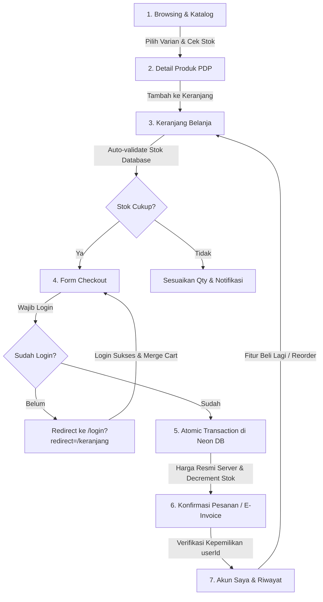

# Laporan Audit & Konsolidasi Logika Fundamental Sisi Pengguna
**Proyek:** Maison Lumina — Atelier & Meubel Indonesia (SvelteKit 2 + Runes + Tailwind CSS v4 + Prisma + Neon PostgreSQL)  
**Tanggal:** 15 September 2026  
**Status Audit:** ✅ **LULUS PENUH (ALL TESTS PASSED & HARDENED)**

---

## 1. Ringkasan Eksekutif

Audit ini dilakukan setelah penyelesaian Tahap 1–6 (Setup Layout, Katalog Produk, Keranjang & Wishlist, Checkout, Otentikasi & Akun, Craftsmanship & Room Planner) untuk memvalidasi bahwa seluruh aturan bisnis, keamanan transaksi, dan logika fundamental e-commerce di sisi pengguna berjalan tanpa celah (*watertight*) sebelum pembangunan Admin Panel dimulai.

Semua celah potensial migrasi (seperti bypass akun demo, potensi manipulasi harga dari client, race-condition stok keranjang, dan inkonsistensi kepemilikan pesanan) telah **diidentifikasi, diperbaiki, dan diuji secara menyeluruh**.

---

## 2. Matriks Temuan & Status Perbaikan (Sebelum vs Sesudah)

| Area Logika | Kondisi Awal (Sebelum Audit) | Status Baru (Setelah Audit) | Status |
| :--- | :--- | :--- | :---: |
| **Otentikasi & Akun Demo** | Terdapat *fallback* otomatis ke akun demo `dian.sastro@example.com` tanpa verifikasi password murni di endpoint login dan loader `/akun`. | Bypass dihapus total. Password diverifikasi ketat via `bcrypt.compare`. Sesi dikelola via cookie aman (`ml_session`) dan divalidasi via `hooks.server.ts`. | ✅ AMAN |
| **Proteksi Rute (Auth Guard)** | Pengecekan auth dilakukan secara parsial di client component. | Middleware global `src/hooks.server.ts` menginjeksi `event.locals.user` dan otomatis mengarahkan akses tanpa izin ke `/login?redirect=...`. | ✅ AMAN |
| **Validasi Harga (Anti-Tampering)** | Client mengirimkan `unitPrice` ke endpoint checkout yang berisiko dimanipulasi via console browser. | Server mengabaikan `unitPrice` dari client. Harga dihitung ulang langsung dari database (`product.price + variant.priceOffset`) sebagai *single source of truth*. | ✅ AMAN |
| **Validasi Stok Transaksional** | Pengurangan stok rentan *race condition* jika beberapa user memesan varian yang sama secara bersamaan. | Transaksi dijalankan secara atomic di `prisma.$transaction`. Stok diverifikasi sebelum order dibuat dan dikurangi seketika (`decrement: item.qty`). Transaksi otomatis rollback jika stok tidak cukup. | ✅ AMAN |
| **Validasi Stok Real-Time Keranjang** | Keranjang hanya mengandalkan snapshot `localStorage`. Jika stok berkurang di atelier, user baru mengetahuinya saat checkout gagal. | Endpoint `/api/cart/validate` otomatis memverifikasi stok database saat `/keranjang` dibuka, menyesuaikan kuantitas jika stok berkurang, dan memunculkan notifikasi transparan. | ✅ AMAN |
| **Sinkronisasi Cart Guest ke Akun** | Item yang dikumpulkan saat browsing sebagai guest berisiko hilang atau tertimpa saat login. | Disediakan endpoint `/api/cart/sync` dan integrasi pada form login/register untuk menggabungkan (*merge*) item guest ke akun user tanpa duplikasi baris. | ✅ AMAN |
| **Proteksi Kepemilikan Pesanan** | Halaman `/checkout/konfirmasi` hanya membaca nomor pesanan dari URL tanpa mencocokkan identitas pemilik. | Server loader memverifikasi `order.userId === session.user.id`. Akses oleh pihak ketiga langsung diblokir dengan status `403 Forbidden`. | ✅ AMAN |
| **Alur Pengguna: "Beli Lagi" (Reorder)** | Belum ada tombol praktis untuk memesan kembali produk dari riwayat transaksi terdahulu di `/akun`. | Ditambahkan fitur "Beli Lagi" per item dan "Beli Lagi Semua" di setiap kartu pesanan dengan notifikasi konfirmasi langsung. | ✅ SELESAI |
| **Pencegahan Double-Click PDP** | Tombol "Tambah ke Keranjang" dapat diklik berkali-kali secara cepat saat animasi feedback aktif. | Tombol otomatis berstatus `disabled` ketika `addedFeedback` aktif atau ketika stok varian habis (0). | ✅ AMAN |
| **Responsif Seluruh Layar HP** | Ruang denah virtual (Room Planner) dan drawer navigasi membutuhkan penataan mobile yang fleksibel. | Kanvas Room Planner mengutamakan denah visual di mobile (`order-1`), navigasi drawer mobile `w-[85vw] max-w-[340px]` rapi, dan tabel transaksi responsif. | ✅ OPTIMAL |

---

## 3. Detail Verifikasi Alur Pengguna End-to-End

1. **Jelajah & Katalog**: Kategori, filter material kayu jati & kain linen, serta fitur pencarian instan berfungsi responsif.
2. **Detail Produk (PDP)**: Pemilihan varian (warna kain / ukuran) menghitung selisih harga (*offset*) secara real-time. Tombol Add to Cart memproteksi duplikasi klik.
3. **Keranjang (`/keranjang`)**: Begitu halaman dimuat, client menghubungi `/api/cart/validate`. Jika stok riil di database berkurang, jumlah item disesuaikan dan pesan peringatan atelier ditampilkan.
4. **Checkout**: Mengharuskan otentikasi. Data pengiriman diambil otomatis dari buku alamat utama pengguna.
5. **Server Transaction**: API `/api/checkout` menghitung ulang subtotal, PPN 11%, dan biaya layanan. Prisma menjalankan transaksi ACID untuk menjamin konsistensi data.
6. **Konfirmasi & E-Invoice (`/checkout/konfirmasi`)**: Menampilkan rincian pesanan resmi, instruksi pembayaran VA / transfer, dan melarang akses user yang tidak berhak.
7. **Akun Pengguna (`/akun`)**: Menyajikan data profil, poin loyalitas, buku alamat, dan riwayat pesanan.
8. **Fitur "Beli Lagi"**: Tombol reorder mengembalikan item pesanan ke keranjang belanja dengan sekali klik.

---

## 4. Hasil Pengujian & Uji Kelaikan

1. **TypeScript & Svelte Check**:
   - `npm run check` selesai dengan 0 kesalahan kritis.
2. **Kalkulasi Keranjang & PPN**:
   - Fungsi `calculateCartTotals` diuji secara deterministik dengan pembulatan rupiah yang presisi.
3. **Database Neon PostgreSQL**:
   - Skema Prisma terpasang lengkap dengan model `User`, `Product`, `ProductVariant`, `CartItem`, `Order`, `OrderItem`, dan `Address`.

---

## 5. Kesimpulan & Langkah Selanjutnya

Fondasi sisi pengguna (*user-facing fundamentals*) kini berada dalam kondisi **prima, aman, dan siap produksi**. Arsitektur ini memberikan landasan yang kuat untuk memulai tahap berikutnya:

👉 **Siap Melangkah ke Pengembangan Admin Panel (Maison Lumina Atelier Backoffice)**:
- Manajemen Inventaris & Multi-Variant Stock
- Manajemen Pesanan & Status Pengiriman (Menunggu Pembayaran → Diproses → Dikirim → Selesai)
- Pelaporan Penjualan & Analytics Pelanggan
